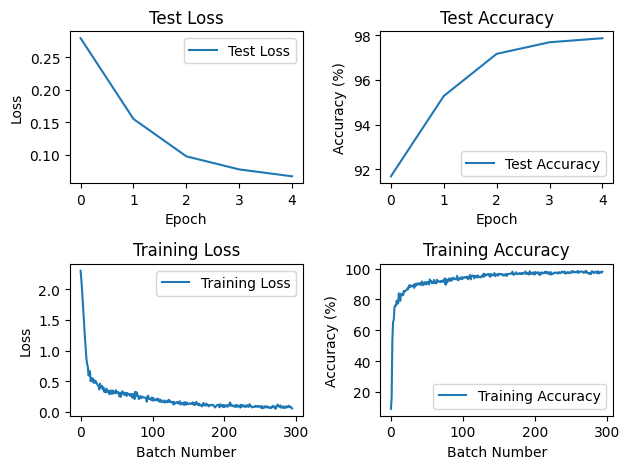
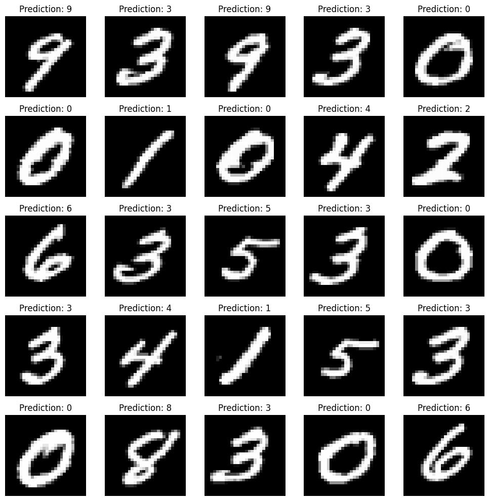
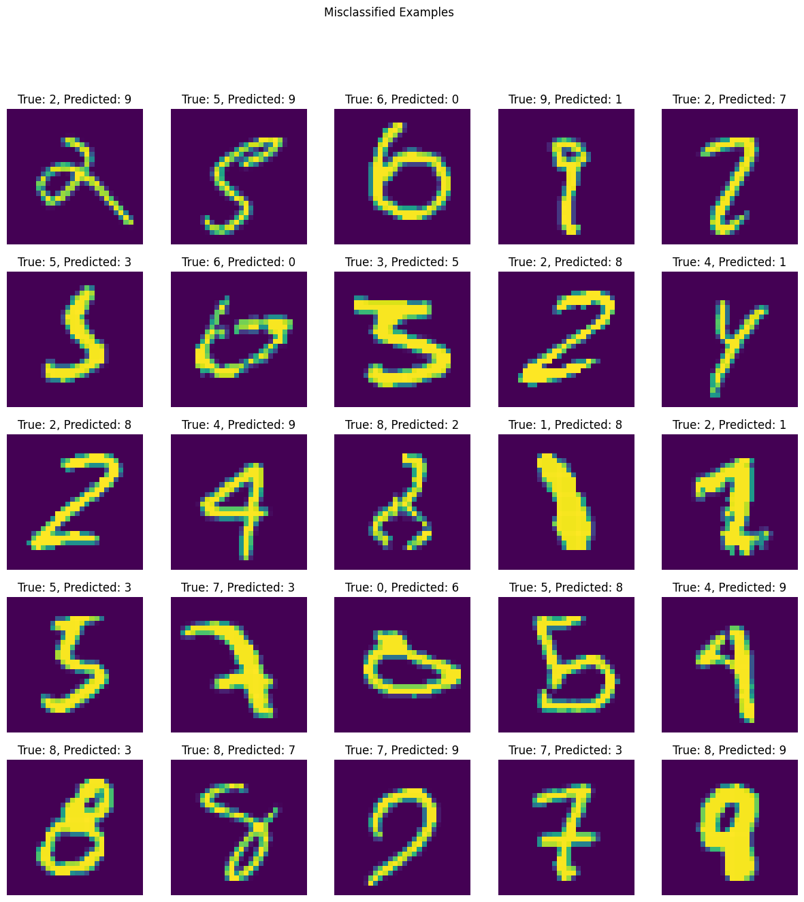

# MNIST Classifier

This basic model which is based on CNN architecture classifies correctly with 98% accuracy images of MNIST dataset.

The model:

```

CNN(
  (conv1): Sequential(
    (0): Conv2d(1, 16, kernel_size=(5, 5), stride=(1, 1), padding=(2, 2))
    (1): ReLU()
    (2): MaxPool2d(kernel_size=2, stride=2, padding=0, dilation=1, ceil_mode=False)
  )
  (conv2): Sequential(
    (0): Conv2d(16, 32, kernel_size=(5, 5), stride=(1, 1), padding=(2, 2))
  )
  (linear): Linear(in_features=6272, out_features=10, bias=True)
)

```





# Some misclassified examples



